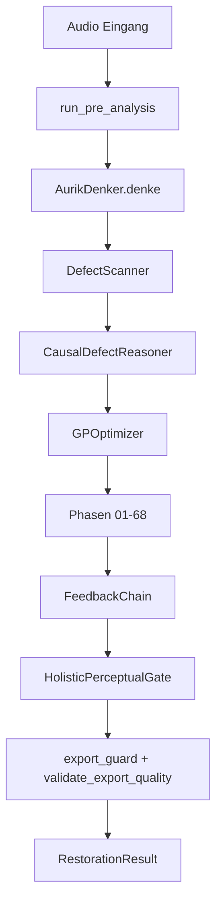

# Aurik 10 — Architektur-Überblick

**Stand:** 2026-09-06
**Version:** 10.0.20
**Status:** RELEASE_MUST-konform | §v10 Pleasantness-First aktiv | Hör-Gates Ebenen 1/2/4 aktiv

> Verbindlicher Wahrheitsstand (normative Kette, `AGENTS.md` §1): `.github/copilot-instructions.md` →
> `.github/VERBOTEN.md` → `.github/instructions/` (hoerordnung + Domain) → `.github/specs/`
> (Index: `00_SPEC_INDEX.md`) → `CLAUDE.md`.

## Kernprinzip (§v10)

**Aurik optimiert JEDEN individuellen Song autonom.** Kein blinder Material-Glaube,
keine statischen Schwellwerte ohne Messung. Die Tonträgerkette, das gemessene SNR,
das tatsächliche Spektrum und die harmonische Dichte des Songs bestimmen ALLE
Parameter — nicht der erkannte Materialtyp allein.

## Kernzahlen (aktuell)

- 69 Phasen-Dateien (Phase 01–66 + Glue Stage + Interface)
- 62 DetectionTypes (DefectScanner) — ALLE SNR-adaptiv
- 62 Kausal-Ursachen (CausalDefectReasoner) — CAUSE_PARAMS SNR-skaliert
- 15 Musical Goals (Spec 01) + 2 vokal-exklusive P0-Gates
- Hör-Gates Ebenen 1/2/4 (level_1_invariants_guard, defect_audibility_gate, vocal_overdrive_guard, einladungs_gate)
- ~18.400 Tests (511 mit Markern)
- 3 neue Messfunktionen: `_estimate_local_snr()`, `_measure_spectral_deviation()`, `_measure_harmonic_density()`

## Kanonischer Release-Vertrag

```text
Audio-Import  -> backend.api.bridge.get_load_audio_fn()
Voranalyse    -> backend.api.bridge.run_pre_analysis() genau einmal
Pipeline      -> get_aurik_denker_instance().denke(...)
Modus         -> restoration | studio2026
Export        -> export_guard() + validate_export_quality() + AudioExporter
```

## Zentrale Komponenten

| Komponente | Zweck |
| --- | --- |
| `AurikDenker` | Kognitive Orchestrierung der Gesamtpipeline |
| `UnifiedRestorerV3` | Phase-Orchestrierung und Kontextsteuerung |
| `DefectScanner` | Defekt-Detektion (62 Typen) |
| `CausalDefectReasoner` | Kausalkette und Mapping auf Phasen (62 Ursachen) |
| `GPOptimizer` | Adaptive Staerke-/Parameteroptimierung |
| `MusicalGoalsChecker` | 15-Goal-Bewertung |
| `HolisticPerceptualGate` | HPI/AFG/VQI-basierte Freigabelogik |
| Hör-Gates E1/2/4 | Level-1-Invarianten, Defect-Audibility, Vocal-Overdrive, Einladungs-Gate (`backend/core/dsp/`) |

## Datenfluss (vereinfacht)



## Qualitäts- und Sicherheitsinvarianten

- `artifact_freedom < 0.95` blockiert Freigabe.
- Vokalpfad nutzt VQI als zusaetzlichen Recovery-Trigger.
- Kein paralleler Produktpfad ausserhalb des kanonischen Vertrags.

## Produktgrenzen

- Desktop-only
- Offline-first
- Mono/Stereo als produktiver Zielpfad
- Keine Cloud-/Serverpflicht im Endnutzerbetrieb
